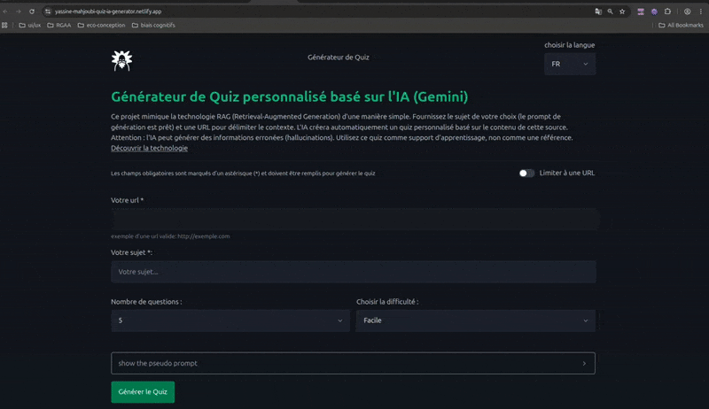

# AI Quiz Generator


**AI Quiz Generator** est une application web qui vous permet de créer des quiz personnalisés à partir de n'importe quelle page web. Fournissez une URL, et notre IA analyse le contenu pour générer un questionnaire pertinent en quelques secondes.

Ce projet est une démonstration technique explorant l'architecture **RAG (Retrieval-Augmented Generation)** avec une stack moderne (Vue.js 3, TypeScript, Gemini AI).



Voir la démo sur [GitHub Pages](https://yassine-mahjoubi.github.io/quiz/) | Voir la démo sur [Netlify](https://yassine-mahjoubi-quiz-ia-generator.netlify.app/)

### Features

- **Architecture RAG Avancée :** Le système choisit automatiquement entre l'API de **Jina AI** et/ ou une solution de scraping interne (`jsdom`, `Readability`) pour garantir la robustesse de l'extraction de données.
- **Architecture d'Hébergement Hybride (CI/CD) :** Le projet utilise deux pipelines de déploiement continus distincts : GitHub Actions pour le front-end sur **GitHub Pages**, et la plateforme Netlify pour les fonctions **serverless** back-end.
- **Stack Technique Moderne :** Le projet est développé en **Vue.js 3** (Composition API) et **TypeScript**, en suivant les meilleures pratiques de qualité de code.

## Architecture et Déploiement

Ce projet possède une configuration de déploiement double, ce qui signifie que le site est construit et hébergé en parallèle à deux endroits distincts.

### Pipeline 1 : Déploiement sur GitHub Pages

- **Ce qui est déployé :** Uniquement le site front-end (l'application Vue.js).
- **Méthode :** Le déploiement est automatisé via un workflow **GitHub Actions**.
- **Déclencheur :** Un `push` sur la branche `main`.
- **Fichier de configuration :** `.github/workflows/deploy.yml`.

### Pipeline 2 : Déploiement sur Netlify

- **Ce qui est déployé :** Le site front-end **ET** la fonction back-end (`parser`).
- **Méthode :** Le déploiement est géré automatiquement par la **plateforme Netlify**, qui est connectée à ce dépôt.
- **Déclencheur :** Un `push` sur la branche surveillée par Netlify (probablement `main`).
- **Fichier de configuration :** `netlify.toml`.

## Fonctionnalités Clés

- **Génération de Quiz IA :** Quiz personnalisés générés par Google Gemini sur n'importe quel sujet
- **RAG Intelligent :** Analyse automatique du contenu web via URL pour limiter le contexte
- **Scraping Adaptatif :**
  - Solution primaire avec **Jina AI Reader API** pour extraction optimisée
  - Fallback automatique vers solution **homemade (jsdom)** si Jina n'est pas disponible ou out of tokens
- **Feedback Transparent :** Indication à l'utilisateur de la méthode utilisée (Jina ou solution homemade)
- **Interface Accessible :** Interface responsive et accessible (en cours d'amélioration RGAA)
- ** Important :** L'IA peut commettre des erreurs

## État d'Avancement

PROJET EN DÉVELOPPEMENT ACTIF - Certaines fonctionnalités sont encore en implémentation.

### Fonctionnalités implémentées :

- ✅ Intégration API Gemini
- ✅ Pipeline pseudo RAG avec Jina Reader
- ✅ Fallback scraping avec jsdom et readability au cas ou Jina n'est pas disponible
- ✅ Analyse si le sujet donné match avec l'url fourni en se basant sur l'IA
- ✅ Interface de quiz interactive accessible

### En cours de développement :

- Conformité RGAA complète pour l'accessibilité
- Tests unitaires (pas encore implémentés)

## 🛠️ Stack Technique

- **Framework :** [Vue.js 3](https://vuejs.org/) (Composition API)
- **Langage :** [TypeScript](https://www.typescriptlang.org/)
- **CSS Framework :** [Pico.css](https://picocss.com/) (pour un style sémantique et léger)
- **Hébergement & Serverless :** [Netlify](https://www.netlify.com/) (Front-end & Fonctions) et [GitHub Pages](https://pages.github.com/)
- **APIs & Services IA :**
  - [Google Gemini](https://ai.google.dev/) pour la génération de quiz
  - [Jina AI Reader](https://jina.ai/reader/) pour l'extraction de contenu web (RAG)
- **Scraping de secours :** jsdom pour parsing HTML/DOM
- **Build Tool :** [Vite](https://vitejs.dev/)
- **Tests :** [Vitest](https://vitest.dev/)
- **Qualité de code :** [ESLint](https://eslint.org/) & [Prettier](https://prettier.io/)

## Compétences Techniques Démontrées

Ce projet met en œuvre et valide la maîtrise des compétences suivantes :

- **Développement Back-End & Serverless :** Conception de fonctions serverless sur Netlify, gestion des dépendances (`node-fetch`, `jsdom`) et déploiement automatisé.
- **Architecture IA & RAG :** Implémentation d'un pipeline RAG, incluant le choix dynamique de la source de données et l'orchestration d'appels à des LLMs (Gemini).
- **Développement Front-End :** Maîtrise de l'écosystème Vue.js 3 (Composition API) et TypeScript pour une application robuste et typée.
- **DevOps & CI/CD :** Configuration de deux pipelines de déploiement distincts (GitHub Actions, Netlify) pour une architecture découplée (front-end statique et back-end serverless).
- **Résilience et Conception de Systèmes :** Mise en place d'un mécanisme de fallback automatique pour assurer la continuité du service (Jina AI vs. solution interne).

## Avertissement

**L'Intelligence Artificielle peut commettre des erreurs !**

- Les quiz générés par Gemini peuvent contenir des hallucinations
- **Toujours vérifier** les informations avec des sources fiables

## Comment ça Marche

1.  **Saisie Utilisateur :** L'utilisateur fournit optionnellement une URL et un sujet précis.
2.  **Extraction du Contenu :**
    - Tentative via **Jina AI Reader** (solution optimisée).
    - Si échec → Basculement automatique vers la solution interne (**jsdom** + **readability**).
3.  **Traitement RAG :** Le contenu extrait est nettoyé et converti au format Markdown (LLM friendly) prêt pour l'IA.
4.  **Vérification de Pertinence du sujet fourni :**
    - L'IA vérifie si le sujet est présent dans le contenu extrait.
    - Si le sujet n'est pas trouvé, un message informe l'utilisateur que le contenu ne correspond pas au sujet demandé.
    - Le processus continue uniquement si le sujet est trouvé (ou si aucune url n'a été fourni).
5.  **Génération IA :** Gemini AI crée le quiz en se basant sur le contenu donné.
6.  **Feedback Transparent :** L'interface indique à l'utilisateur la méthode d'extraction qui a été utilisée.

## Installation et Lancement

1. **Clonez le dépôt :**

   ```bash
   git clone https://github.com/yassine-mahjoubi/quiz.git
   ```

2. **Accédez au dossier du projet :**

   ```bash
   cd quiz
   ```

3. **Installez les dépendances :**

   ```bash
   npm install
   ```

4. **Installer les dépendances de la fonction Netlify :**

   ```bash
   cd netlify/functions/parser && npm install && cd -
   ```

5. **Configurez les clés d'API :**
   Commencez par copier le fichier d'exemple pour créer votre propre fichier d'environnement local :

   ```bash
   cp .env.example .env.local
   ```

   Ensuite, ouvrez le nouveau fichier `.env.local` et remplissez les variables avec vos clés d'API personnelles :

   ```env
   # .env.local
   VITE_KEY_GEMINI_API_KEY=VOTRE_CLE_PERSONNELLE_GEMINI
   VITE_JINA_API_KEY=VOTRE_CLE_PERSONNELLE_JINA
   ```

6. **Lancez le serveur de développement de Netlify:**
   ```bash
   netlify dev
   ```

## Scripts Disponibles

- `netlify dev`: Lance l'environnement de développement complet (front-end et fonctions Netlify).
- `npm run build`: Compile l'application pour la production
- `npm run test:unit`: Tests unitaires (pas encore implémentés)
- `npm run lint`: Analyse le code pour trouver les problèmes de style

---
